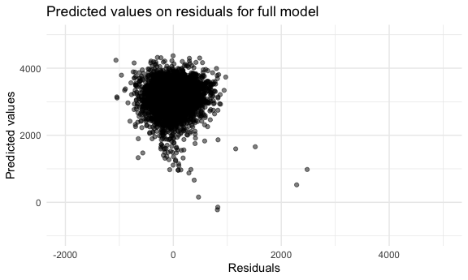
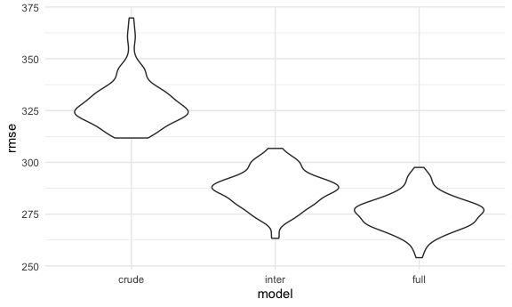
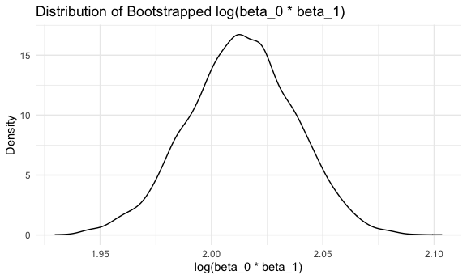

Homework 6
================
Adam Whalen

## Problem 1

Read in the data.

``` r
homicide_df = 
  read_csv("./data/homicide-data.csv") %>% 
  mutate(
    city_state = str_c(city, state, sep = ", "),
    victim_age = as.numeric(victim_age),
    resolution = case_when(
      disposition == "Closed without arrest" ~ 0,
      disposition == "Open/No arrest"        ~ 0,
      disposition == "Closed by arrest"      ~ 1,
    )
  ) %>% 
  filter(city_state != "Tulsa, AL",
         victim_race %in% c("White", "Black")) %>% 
  select(city_state, resolution, victim_age, victim_race, victim_sex)
```

    ## Warning: Problem with `mutate()` input `victim_age`.
    ## ℹ NAs introduced by coercion
    ## ℹ Input `victim_age` is `as.numeric(victim_age)`.

    ## Warning in mask$eval_all_mutate(dots[[i]]): NAs introduced by coercion

Start with one city.

``` r
baltimore_df = 
  homicide_df %>% 
  filter(city_state == "Baltimore, MD")

glm(resolution ~ victim_age + victim_race + victim_sex,
    data = baltimore_df,
    family = binomial()) %>% 
  broom::tidy() %>% 
  mutate(
    OR = exp(estimate),
    CI_lower = exp(estimate - 1.96 * std.error),
    CI_upper = exp(estimate + 1.96 * std.error)
  ) %>% 
  select(term, OR, starts_with("CI")) %>% 
  knitr::kable(digits = 3)
```

| term              |    OR | CI\_lower | CI\_upper |
| :---------------- | ----: | --------: | --------: |
| (Intercept)       | 1.363 |     0.975 |     1.907 |
| victim\_age       | 0.993 |     0.987 |     1.000 |
| victim\_raceWhite | 2.320 |     1.648 |     3.268 |
| victim\_sexMale   | 0.426 |     0.325 |     0.558 |

Try this across cities.

``` r
model_results_df = 
  homicide_df %>% 
  nest(data = -city_state) %>% 
  mutate(
    models = 
      map(.x = data, 
          ~glm(resolution ~ victim_age + victim_race + victim_sex,
            data = .x,
            family = binomial())),
    results = map(models, broom::tidy)
  ) %>% 
  select(city_state, results) %>% 
  unnest(results) %>% 
  mutate(
    OR = exp(estimate),
    CI_lower = exp(estimate - 1.96 * std.error),
    CI_upper = exp(estimate + 1.96 * std.error)
  ) %>% 
   select(city_state, term, OR, starts_with("CI"))
```

``` r
model_results_df %>% 
  filter(term == "victim_sexMale") %>% 
  mutate(city_state = fct_reorder(city_state, OR)) %>% 
  ggplot(aes(x = city_state, y = OR)) +
  geom_point() +
  geom_errorbar(aes(ymin = CI_lower, ymax = CI_upper)) +
  theme(axis.text.x = element_text(angle = 90, hjust = 1, vjust = 0.6))
```


## Problem 2

We will be looking at data on baby birthweight and building regression
models incorporating various social and biological covariates.

``` r
baby_df = 
  read_csv("./data/birthweight.csv") %>% 
  mutate(
    babysex = as_factor(babysex),
    frace = as_factor(frace),
    malform = as_factor(malform),
    mrace = as_factor(mrace),
    parity = as_factor(parity),
    pnumsga = as_factor(pnumsga),
    prior_lbw = case_when(
      pnumlbw == 0 ~ 0,
      pnumlbw > 0  ~ 1
    ),
    prior_lbw = as_factor(prior_lbw)
  )
```

#### Fit the models

We will be comparing three models: a crude model with just length and
gestational weeks; an interactions model with head circumference,
length, sex, and all interactions (including 3-way); and a full model,
that includes head circumference, length, sex, mother’s race as a proxy
for lived experience of racism, family income as a proxy for adequate
perinatal medical care, presence of malformations, and the interaction
of mother’s pre-pregnancy weight and her gestational weight. I chose
these variables a priori because I believe that they will have the
greatest impact on birthweight with a clear mechanism.

``` r
model_crude = lm(bwt ~ blength + gaweeks, data = baby_df)
model_inter = lm(bwt ~ bhead * blength * babysex, data = baby_df)
model_full = lm(bwt ~ bhead + blength + babysex + mrace + fincome + malform + delwt * ppwt, 
                data = baby_df)
```

Now that our models have been developed, let’s create the residuals and
predicted values for each.

``` r
crude_model_df = 
  baby_df %>% 
  modelr::add_residuals(model_crude) %>% 
  modelr::add_predictions(model_crude)
  
inter_model_df = 
  baby_df %>% 
  modelr::add_residuals(model_inter) %>% 
  modelr::add_predictions(model_inter)

full_model_df = 
  baby_df %>% 
  modelr::add_residuals(model_full) %>% 
  modelr::add_predictions(model_full)
```

And now, let’s plot those residuals and predicted values for each model.

``` r
crude_resid_plot = 
  crude_model_df %>% 
  ggplot(aes(x = resid, y = pred)) +
  geom_point(alpha = 0.5) +
  xlim(-2000, 5000) +
  ylim(-1000, 5000) +
  labs(
    title = "Predicted values on residuals for crude model",
    x = "Residuals",
    y = "Predicted values"
  )

inter_resid_plot = 
  inter_model_df %>% 
  ggplot(aes(x = resid, y = pred)) +
  geom_point(alpha = 0.5) +
  xlim(-2000, 5000) +
  ylim(-1000, 5000) +
  labs(
    title = "Predicted values on residuals for interaction model",
    x = "Residuals",
    y = "Predicted values"
  )

full_resid_plot = 
  full_model_df %>% 
  ggplot(aes(x = resid, y = pred)) +
  geom_point(alpha = 0.5) +
  xlim(-2000, 5000) +
  ylim(-1000, 5000) +
  labs(
    title = "Predicted values on residuals for full model",
    x = "Residuals",
    y = "Predicted values"
  )

crude_resid_plot
```


``` r
inter_resid_plot
```


``` r
full_resid_plot
```



From these plots, we can see that while the interaction and full models
are very similar, the crude model has much larger residuals and
predicted values, meaning that it is likely a poorer fit for the data.

To further explore this, we will do some cross validation to see which
model is better at predicting the data.

``` r
cv_df =
  crossv_mc(baby_df, 100) %>% 
  mutate(
    train = map(train, as_tibble),
    text = map(test, as_tibble),
    crude_mod = map(.x = train, ~lm(bwt ~ blength + gaweeks, data = .x)),
    inter_mod = map(.x = train, ~lm(bwt ~ bhead * blength * babysex, data = .x)),
    full_mod = map(.x = train, ~lm(bwt ~ bhead + blength + babysex + mrace + fincome + 
                                    malform + delwt * ppwt, data = .x)),
    rmse_crude = map2_dbl(.x = crude_mod, .y = test, ~rmse(model = .x, data = .y)),
    rmse_inter = map2_dbl(.x = inter_mod, .y = test, ~rmse(model = .x, data = .y)),
    rmse_full = map2_dbl(.x = full_mod, .y = test, ~rmse(model = .x, data = .y))
  )

cv_plot = 
  cv_df %>% 
  select(starts_with("rmse")) %>% 
  pivot_longer(
    everything(),
    names_to = "model",
    names_prefix = "rmse_",
    values_to = "rmse"
  ) %>% 
  mutate(model = fct_inorder(model)) %>% 
  ggplot(aes(x = model, y = rmse)) +
  geom_violin()

cv_plot
```



Based on our cross validation, it appears that the full model we
proposed has the best fit for the data, as it has the lowest root mean
squared error.

## Problem 3

For this problem, we will be using bootstrapping to evaluate the NOAA
weather data frame.

``` r
weather_df = 
  rnoaa::meteo_pull_monitors(
    c("USW00094728"),
    var = c("PRCP", "TMIN", "TMAX"), 
    date_min = "2017-01-01",
    date_max = "2017-12-31") %>%
  mutate(
    name = recode(id, USW00094728 = "CentralPark_NY"),
    tmin = tmin / 10,
    tmax = tmax / 10) %>%
  select(name, id, everything())
```

Now to create a simple linear regression of minimum temperature
predicting maximum temperature.

``` r
weather_model = lm(tmax ~ tmin, data = weather_df)
```

Rad, now let’s bootstrap.

``` r
weather_strap_df = 
  weather_df %>% 
  bootstrap(5000, id = "strap_number") %>% 
  mutate(
    models = map(.x = strap, ~lm(tmax ~ tmin, data = .x)),
    betas = map(models, broom::tidy),
    r_squared = map(models, broom::glance)
    ) %>% 
  unnest(betas) %>% 
  select(-c("std.error":"p.value")) %>% 
  unnest(r_squared) %>% 
  janitor::clean_names() %>% 
  select(strap_number, term, estimate, r_squared) %>% 
  pivot_wider(
    everything(),
    names_from = term,
    values_from = estimate
  ) %>% 
  rename(
    beta_0 = "(Intercept)",
    beta_1 = tmin
  ) %>% 
  mutate(
    log_betas = log(beta_0 * beta_1)
  )
```

Cool, now let’s examine the distribution of both R-squared and
log(beta\_0 \* beta\_1).

``` r
log_beta_plot = 
  weather_strap_df %>% 
  ggplot(aes(x = log_betas)) +
  geom_density() +
  labs(
    title = "Distribution of Bootstrapped log(beta_0 * beta_1)",
    x = "log(beta_0 * beta_1)",
    y = "Density"
  )

r_squared_plot = 
  weather_strap_df %>% 
  ggplot(aes(x = r_squared)) +
  geom_density() +
  labs(
    title = "Distribution of Bootstrapped R-squared",
    x = "R-squared",
    y = "Density"
  )

log_beta_plot
```



``` r
r_squared_plot
```


The distribution of log(beta\_0 \* beta\_1) appears to be normal, with a
range from roughly 1.90 to 2.08, and a peak near 2.04. Similarly, the
distribution of R-squared also seems to be mostly normal, with a range
from 0.87 to 0.94, a peak around 0.91, and slight left-skewness.

Let’s now create a tibble of the estimated CI for both measures.

``` r
ci_df = 
  weather_strap_df %>% 
  summarize(
    r_ci_lower = quantile(r_squared, 0.025),
    r_ci_upper = quantile(r_squared, 0.975),
    b_ci_lower = quantile(log_betas, 0.025),
    b_ci_upper = quantile(log_betas, 0.975)
  ) %>% 
  knitr::kable(
    col.names = c("R-squared CI Lower Bound",
                  "R-squared CI Upper Bound",
                  "Log-betas CI Lower Bound",
                  "Log-betas CI Upper Bound"),
    digits = 2
  )

ci_df
```

| R-squared CI Lower Bound | R-squared CI Upper Bound | Log-betas CI Lower Bound | Log-betas CI Upper Bound |
| -----------------------: | -----------------------: | -----------------------: | -----------------------: |
|                     0.89 |                     0.93 |                     1.96 |                     2.06 |
